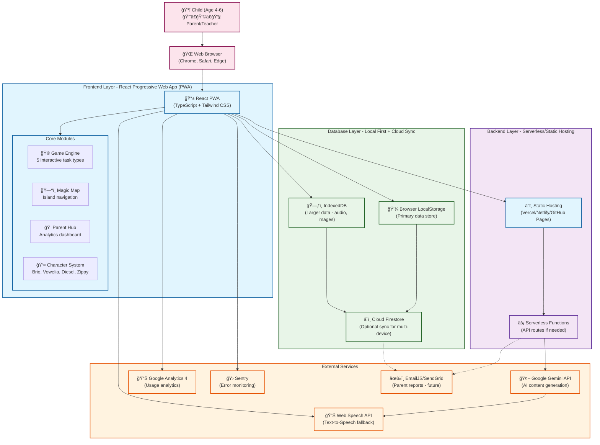

# 🎙️ Phonics Kingdom

**Phonics Kingdom** is an immersive, play-first educational platform designed for children aged 4-6. It transforms foundational literacy—phonemic awareness, letter-sound correspondence, and CVC blending—into a "stealth learning" adventure.

Built with a "vibe-coding" philosophy and powered by the **Google Gemini API**, Phonics Kingdom leverages generative AI to create a dynamic, adaptive, and infinitely replayable world.

---

## 🌟 The Vision

Most literacy apps are either "digital worksheets" or "empty entertainment." Phonics Kingdom reconciles these by creating a persistent world where spelling and phonics are the core mechanics of play.

- **Objective:** Defeat the **Static Scrambler** and restore the sounds of the Kingdom.
- **Methodology:** Evidence-based phonics curriculum wrapped in a 2.5D gamified experience.
- **AI Core:** Real-time task generation, unique character voices, and custom-drawn visuals for every learning prompt.

---

## 🦊 Meet the Sound Squad

The Kingdom is protected by an original cast of characters, each representing a key phonics pillar:

| Character | Role | Mechanic |
| :--- | :--- | :--- |
| **Brio the Beatboxer** | Master of Rhythm | Phonemic awareness, syllables, and sound blending. |
| **Vowelia** | Magical Weaver | Short vowel recognition and placement. |
| **Diesel the Digger** | Sound Builder | "Digging up" beginning consonants and building word foundations. |
| **Zippy the Zoomer** | Rhyme Racer | Ending sounds, rhyming patterns, and sight words. |

---

## 🚀 Key Features

### 1. **Adaptive Learning Engine**
The app doesn't just show static flashcards. The `gemini-3-flash-preview` model acts as a "Dungeon Master," generating task wording that matches the selected character's personality and the child's current mastery level.

### 2. **Multimodal AI Integration**
- **Visuals:** `gemini-2.5-flash-image` draws a custom illustration for every task to provide context for non-readers.
- **Audio:** `gemini-2.5-flash-preview-tts` provides high-quality, character-specific voices for all instructions.
- **Logic:** Adaptive difficulty ensures children stay in the "flow state"—not too easy to be boring, not too hard to be frustrating.

### 3. **Parent Dashboard**
A jargon-free hub for parents to see real progress.
- **Accuracy Tracking:** See which sounds are mastered and which need more play.
- **Educational Insights:** Plain-language summaries of what "Phonemic Awareness" actually means for their child.
- **Offline Extensions:** AI-suggested real-world activities to reinforce learning.

---

## 🛠️ Technical Stack

- **Frontend:** React 19 (ESM), Tailwind CSS.
- **Intelligence:** `@google/genai` (Google Gemini SDK).
- **Audio:** Web Audio API (PCM Decoding).
- **Visuals:** Vector-based parallax Magic Map + AI-generated Task Art.
- **Fonts:** Dyslexia-friendly (Andika) and high-legibility (Lexend).

---

## 🏗️ System Architecture

### Architecture Summary

| Layer | Component | Technology | Purpose |
|-------|-----------|------------|---------|
| **Frontend** | React PWA | React 18 + TypeScript + Tailwind CSS | Game UI, task rendering, parent dashboard |
| **Backend** | Static Hosting | Vercel/Netlify Functions | Serves React build, API routes for external calls |
| **Database** | Local Storage | Browser LocalStorage + IndexedDB | Saves game progress, user data, cached assets |
| **External** | AI Service | Google Gemini API | Generates phonics tasks, narratives, images |
| **External** | TTS Service | Web Speech API + Gemini TTS | Text-to-speech for instructions, feedback |
| **External** | Analytics | Google Analytics 4 + Sentry | Usage tracking, error monitoring |

### Key Architecture Decisions

- **Offline-First**: Children play in cars, planes, areas with poor connectivity
- **Cost-Effective**: No server costs until you scale (static hosting is free)
- **Simple Maintenance**: No database administration, server management
- **COPPA Compliant**: Data stays on device by default

### Implementation Status

✅ React PWA, LocalStorage, Web Speech API  
✅ Gemini AI integration (with offline fallback)  
🔜 Cloud sync for multi-device, email reports for parents

---

## � User Flows

### Flow Summary

| User | Auth Required | Data Storage | Key Features |
|------|---------------|--------------|--------------|
| **Child** | ❌ None | LocalStorage + IndexedDB | Zero friction, instant play, offline-first |
| **Parent** | ✅ Math gate | Cloud Firestore | Analytics, payments, settings control |

### Design Principles

- **Children**: Zero friction, no passwords, 3 clicks to first game
- **Parents**: Simple math gate (5+3), dashboard access, payment control
- **COPPA Compliant**: No PII collected from children, device-based identification

### Freemium Model

| Feature | Free Tier | Premium |
|---------|-----------|---------|
| Islands | Consonant Cove only | All 5 islands |
| Characters | 1 character | All 4 characters |
| Analytics | Basic progress | Detailed reports |
| New Content | Delayed | Early access |

**Pricing**: Monthly $4.99 / Annual $49.99 (save 16%)
---

## 🎮 Core Gameplay Loop

```mermaid
flowchart TD
    Start["**START**<br/>Child starts phonics task"]
    Display["**Task Display**<br/>Shows picture 🍋, speaks instruction 🔊"]
    Interaction{"**Child Attempts Answer**"}
    Decision{"**Correct?**"}
    
    %% Success Path
    SuccessFeedback["**SUCCESS** ✅<br/>Green check, 'Great job!'"]
    SuccessTeaching["**Reinforce**<br/>'L says /l/ like lemon!'"]
    SuccessPoints["**Award** ⭐ +1 star"]
    
    %% Failure Path
    FailureFeedback["**TRY AGAIN** ❌<br/>Gentle correction, hints"]
    FailureTeaching["**Teach**<br/>'Actually, L says /l/'"]
    FailureRetry{"**Retry?**"}
    
    %% Progress Check
    MoreTasks{"**More Tasks?**"}
    NextTask["**Next Task**"]
    Complete["**Session Complete** 🎉"]
    Mastery{"**≥85% Accuracy?**"}
    Shard["**💎 Award King Shard**"]
    Save["**Save Progress**<br/>LocalStorage + IndexedDB"]
    End["**END** ↩️ Magic Map"]
    
    Start --> Display --> Interaction --> Decision
    Decision -- Yes --> SuccessFeedback --> SuccessTeaching --> SuccessPoints --> MoreTasks
    Decision -- No --> FailureFeedback --> FailureTeaching --> FailureRetry
    FailureRetry -- Yes --> Interaction
    FailureRetry -- No --> MoreTasks
    MoreTasks -- Yes --> NextTask --> Display
    MoreTasks -- No --> Complete --> Mastery
    Mastery -- Yes --> Shard --> Save --> End
    Mastery -- No --> Save --> End
```

### Pedagogical Design

| Step | Educational Principle |
|------|----------------------|
| **Teaching AFTER answer** | Assessment-first, prevents answer leaks |
| **Corrective feedback** | Zone of Proximal Development |
| **Partial credit** | Growth mindset encouragement |
| **Error tracking** | Data-driven adaptation |
| **85% mastery threshold** | Competency-based progression |

### Error Patterns Tracked

- `b-d-confusion`: Mixes "b" and "d" sounds
- `short-vowels`: Confuses short vowel sounds  
- `ending-sounds`: Struggles with ending sounds
- `blend-segmentation`: Difficulty separating blends
---

## �📥 Getting Started

### Prerequisites
- An active **Google Gemini API Key**.
- A modern browser with Microphone and Audio permissions enabled.

### Setup
1. Clone the repository.
2. Ensure `process.env.API_KEY` is configured in your environment.
3. Serve the `index.html` file using any standard dev server (e.g., Vite, Live Server).

---

## 📋 Roadmap

- [x] Phase 1: Core IP and character logic.
- [x] Phase 2: AI-driven task and visual generation.
- [ ] Phase 3: "Party Play" (Asynchronous cooperative missions).
- [ ] Phase 4: Mobile deployment (iOS/Android/Amazon Fire).

---

## ⚖️ Legal & Privacy

- **IP Status:** All characters (Brio, Vowelia, Diesel, Zippy) and "Phonics Kingdom" branding are original creative works.
- **Privacy:** Designed with **COPPA/GDPR-K** principles. No child-identifiable data is stored; all AI interactions are anonymized.

---

*“Play is the highest form of research.” — Albert Einstein*